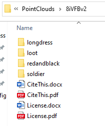
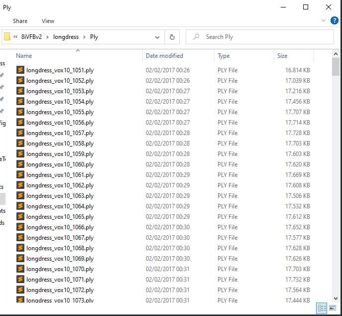
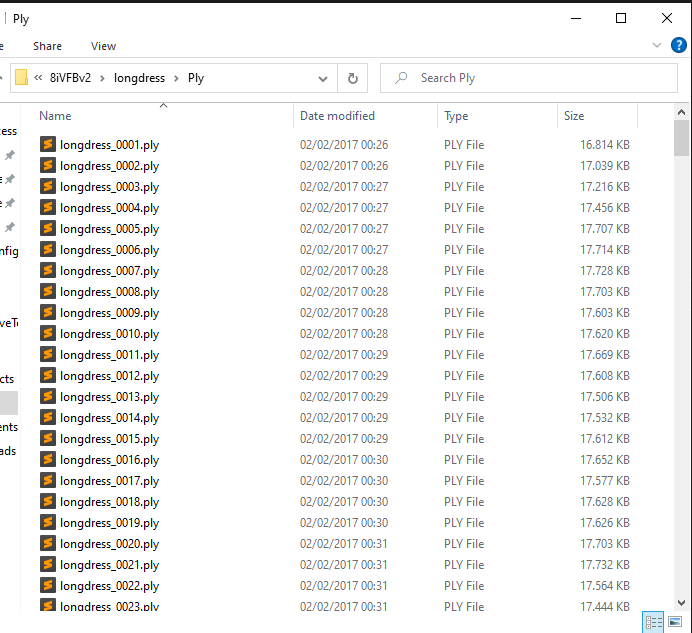
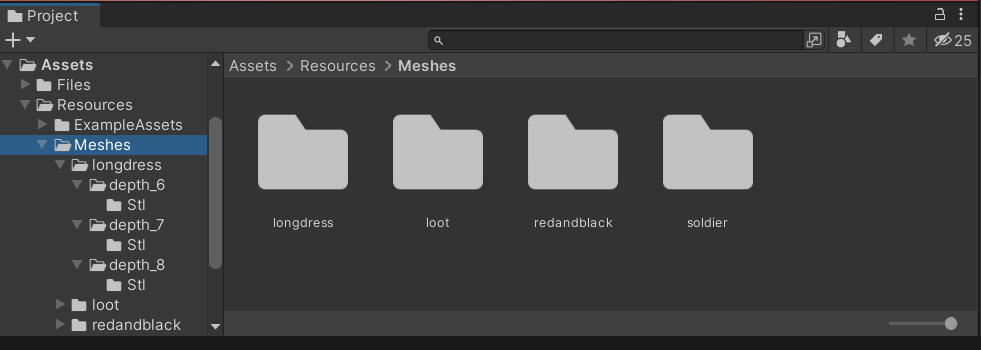
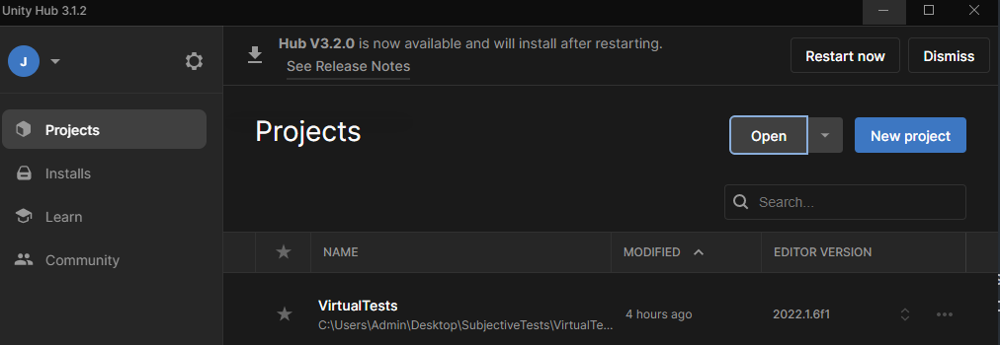
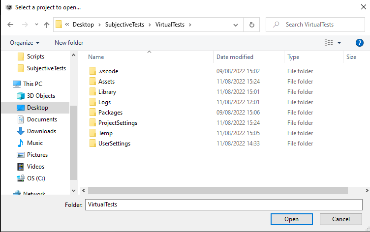
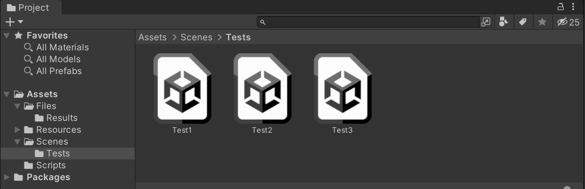
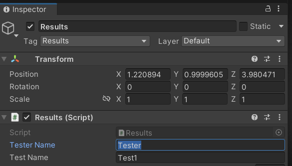
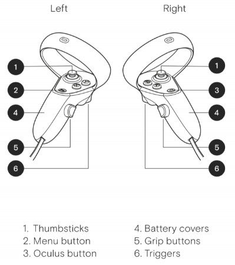

# SubjectiveTests

## Introduction

This project is conducted in the context of the internship of Daniel Wieczorek under the supervision of and with the consent of Jeroen van der Hooft, Maria Torres Vega and Hemanth Kumar Ravuri. The goal of the IAESTE internship is to provide an interactive application that allows to interact with (touch) virtual objects created from rendered point cloud video to an immersed user. The SenseGloves NOVA haptic gloves will be used to provide the interaction. Evaluate by means of subjective evaluations the degree of interactivity experienced with the different options.


## Requirements

### Hardware

* The machine used in this project is equipped with an Intel core i7 processor, 16 GB of RAM, and an Nvidia Geforce RTX 2070 with max-Q design. Anything equivalent should work as well.
* Oculus Quest 2 128GB
* USB-C to USB-C Cable that supports USB3.2 GEN1 with 5Gbps bandwidth.
* SenseGloves NOVA haptic gloves

### Software

#### Unity Version

The unity version used for this project is 2022.1.6f1.

#### Packages

* XR Interaction Toolkit 2.0.2
* XR Plugin Management 4.2.1

#### Miniconda3

Also make sure that you have the pymeshlab library installed.
If not, run the following command to install it.

`pip install pymeshlab`

#### Oculus App

#### SenseCom

The software necessary to use the SenseGloves NOVA is included in [the official GitHub repository](https://github.com/Adjuvo/SenseGlove-Unity).

## Steps to follow


### Convert PointClouds to Meshes

We will be using the [JPEG Pleno Database: 8i Voxelized Full Bodies (8iVFB v2)](http://plenodb.jpeg.org/pc/8ilabs/) with 4 different human subjects. We will first convert these objects to meshes.

1. Download the [8iVFB dataset](http://plenodb.jpeg.org/pc/8ilabs/) (5.5GB)

2. Navigate to the "PointCloudConverter" directory and extract the files in the "PointClouds" folder. You should have the following file structure.





**IMPORTANT NOTE**: keep the same folder names and structure. If you change them, make sure you change the input variables in the scripts.

```
	>PointCloudConverter
		>PointClouds
			>8iVFBv2
				>longdress
					>Ply
						>longdress_vox10_1051.ply
				>loot
				>redandblack
				>soldier
			>RenameFiles.py
		>Meshes
		>Scripts
		>meshlab.py
```

3. Navigate to the PointClouds folder in terminal and run the RenameFiles.py script.
```
>>>python RenameFiles.py
```

Once this is done, your Ply folders should look like this:



4.	In terminal, navigate back to the PointCloudConverter directory and run the meshlab.py script.

```
>>>python meshlab.py
```

You can also specify which object you want to convert, at which depth, starting from which frame and ending at which one.

* -o --object = Which type of pointcloud is to be converted. ['longdress', 'loot', 'redandblack', 'soldier']. If not given, all 4 are taken. If not precised, all objects will be considered.
* -d --depth = If depth is given, the meshes for that depth are constructed. If not they are made for 6,7 and 8. If not precised, all depths will be considered.
* -s --start = Starting frame number. If not precised, frames created will start from 1.
* -e --end = Ending frame number. If not precised, frames created will end at 300.

**Example**: 
```
>>>python meshlab.py -o longdress -d 8 -s 150 -e 300
```
 This will only create 150 frames of the longdress object at depth 8.

**IMPORTANT NOTE**: Depending on the machine running, this process will take hours to finish running. We recommend converting only 150 frames per object as only these will be used in the subjective tests. 

5. Once that's established, you can copy the Meshes folder into the MeshRenderer/Assets/Resources directory


**IMPORTANT NOTE**: Do not change the file structure.

### Set-up your Oculus Quest
Before opening the Unity project, make sure that you Oculus Quest is well set-up and works properly.


### Open Unity Project

1. Open Unity Hub. Make sure you have the Unity 2022.1.6f1 version installed. Then, open the folder VirtualTests as a Unity Project. If the project takes too much time to load, delete the Meshes folder. Once the project opens, you can copy back the meshes one object at a time. This is due to the large memory size of the meshes.





2. In Unity Editor, navigate to the Scenes folder and open Test1.



3. Click on the Results GameObject. In the Inspector, write your name under Tester Name. 



**IMPORTANT NOTE**: After you finish Test1, redo the steps 2 and 3 on Test2 and Test3.

Once you play the scene, you will be placed inside a virtual room. You will navigate through the different parts of the test using the red sphere in front of you. To do that, you will use your controller to point the laser beam at the sphere. Once the beam light turns white, you can click on the grip button.



### Test 1

Once the scene loads, you will see four clones of the same object each at a different quality representation. 

1. Rate the quality of the 4 objects

First, you will be asked to rate each object on a scale from 0 to 10 with 10 being the highest quality. You can get closer to objects A, B and C to examine them. However, you can only evaluate object D from a distance. Take your time to look at the objects and evaluate their quality. Use your controller's trigger button to move the sliders. 

2. Match the quality of object D
Once all objects are rated, you will look again at object D and try to match its quality to either object A, B or C. When you make your choice, point at the buttons A, B or C and select it using the trigger button.

3. Once you are certain of your choices, you can click on the red sphere to move to the next part. Redo the same steps for part 2.

### Test 2

For this test, you will see four clones of an object. The quality representation of each one will change dynamically over time. Your task is to rate the overall quality of each of them. You will also indicate how noticeable is the change in qualities. Again, use the sliders to rate the objects.

Take your time to observe the objects. 

Once you are certain of your choices, you can click on the red sphere to move to the next part.


### Test 3

During the final test, you will look at two different objects and choose the one with the higher quality by clicking on the button on top of it. You can also indicate if you do not see any difference of quality between the objects by clicking on the button in the middle.


## Trouble-Shooting

If you run into a problem, there could be many reasons for that. Here is a list of possible reasons why that happened. If you still can't figure out the problem, there are a lot of forums that you can check.

### Project Settings

Make sure that all packages and the project settings are in order.

### Cable Compatibility

 Having a faulty cable or not enough bandwidth can affect your experience. Make sure that you have a USB 3.0 and use the Oculus App to Test the connection.

### Update drivers

If the problem still persists, update your USB drivers.

### Check Components

 Make sure that all components are checked for each game object. 

### Initialization

Make sure you have correctly added all the initialization variables.
Make sure that all frames are present in the Resources directory in with the right depths.

### Power Limitations

One possible reason can be the power consumption limitations in some machines.


